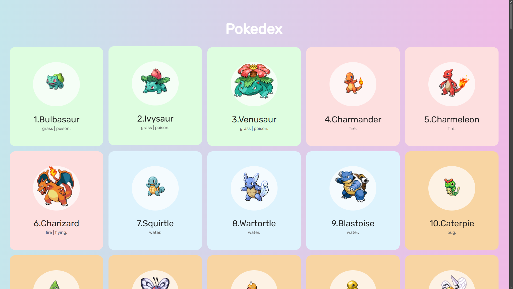
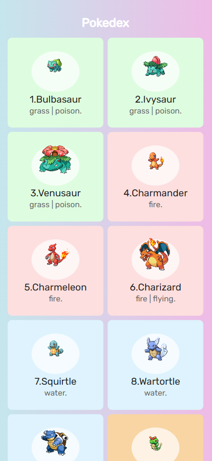

# Pokedex v2 🧩


A modern Pokedex web application built with HTML, CSS, and JavaScript, consuming data from the public PokeAPI.

This project demonstrates practical frontend skills such as API consumption, asynchronous JavaScript, DOM manipulation, and responsive UI design.

---

## 🚀 Live Demo
👉 https://bruno-pokedex-v2.netlify.app/

---

## 🛠 Tech Stack
- HTML5
- CSS3
- JavaScript (ES6+)
- PokeAPI (REST API)

---

## ✨ Features
- Fetches real-time Pokémon data from an external API
- Displays Pokémon name, image, and basic information
- Responsive layout for desktop and mobile devices
- Clean and user-friendly interface
- Asynchronous data handling using `async/await`

---

## 📚 What I Learned
- Working with REST APIs and handling asynchronous requests
- Manipulating the DOM dynamically based on API responses
- Structuring frontend code for better readability
- Improving UI responsiveness using modern CSS techniques

---

## 📸 Screenshots



---

## 🧪 Run Locally
```bash
git clone https://github.com/BrunoMiranda97/Pokedex_v2.git
cd Pokedex_v2
Then open index.html in your browser.
```

🌱 Future Improvements

Search functionality

Pagination

Error handling for API failures

Improved accessibility

👨‍💻 Author

Bruno Miranda
[GitHub](https://github.com/BrunoMiranda97?utm_source=chatgpt.com) • [LinkedIn](https://www.linkedin.com/in/brunomiranda97/)
